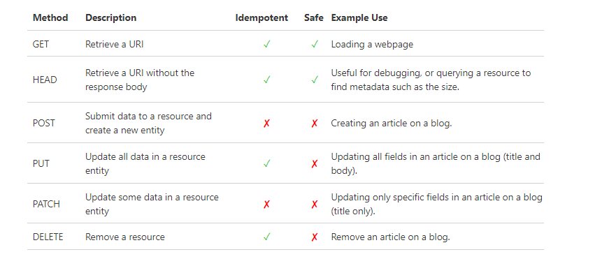

<b>  What is API? Give 3 real-life examples of usage of API. </b>

This is a common Google feature that many smartphone users put to use every day, if not several times a day. It's also a convenience many have taken for granted. This is because weather snippets are a prime API example, showing how Google coordinates with other software on the web.

Another popular API example is PayPal. PayPal is a fintech service that allows users to connect personal financial information to their PayPal account. This paves the way for easier, more secure money transfers. You'll see PayPal intentionally embedded into any number of websites that require financial transactions, from eBay to Airbnb. The websites interacting with PayPal will not have direct access to your bank or card info. Your security in this regard is because of API integrations.

The Google Maps API gives users the privilege of nearly limitless geographic aptitude at their fingertips. Search nearby restaurants, niche shops, and whatever else is in relative distance to your location. You may have been using this API example more often than you realize. Each time you glimpsed business hours, reviews, contact information, or anything of that nature from that handy box on your screen, that is the Google Maps API in action.

<b>What is API testing and name some types of API testing?</b>

API testing is a software testing practice that tests the APIs directly — from their functionality, reliability, performance, to security. Part of integration testing, API testing effectively validates the logic of the build architecture within a short amount of time.

 API Testing types

<li> Validation testing </li>
<li> UI testing </li>
<li> Functional testing </li>
<li> Security testing </li>
<li> Load testing </li>

<b> What is the difference between REST and SOAP APIs? </b>

 SOAP is a protocol, whereas REST is an architectural style 

 REST APIs access a resource for data (a URI); SOAP APIs perform an operation 

 SOAP supports WS-Security while REST can use the secure version of the HTTP protocol, HTTPS. 

 SOAP requires more bandwidth, whereas REST requires fewer resources (depending on the API) 

 REST calls can be cached, while SOAP-based calls cannot be cached 

<b> What are common HTTP methods? Explain with examples. </b>

 The HTTP/1.1 specification defines a number of methods that indicate the action that a given resource should take upon receipt of a request. These are also known as 'HTTP Verbs'. 

Requests can be idempotent, meaning that they can be executed multiple times and you should see the same response each time, and requests can also be safe, meaning that the request should only retrieve data and not complete any other action.

<b> What is the difference between POST AND put? Explain with an example. <b> 

<li> PUT method is called when you have to modify a single resource while POST method is called when you have to add a child resource.</li>
<li> PUT method response can be cached but you cannot cache POST method responses.</li>
<li> You can use UPDATE query in PUT whereas you can use create query in POST.</li>
<li> In PUT method, the client decides which URI resource should have, and in POST method, the server decides which URI resource should have.</li>
<li> PUT works as specific while POST work as abstract.</li>
<li> If you send the same PUT request multiple times, the result will remain the same but if you send the same POST request multiple times, you will receive different results.</li>
  <li> PUT method is idempotent whereas POST method is not idempotent.</li>

 
<b> Name 5 main categories of HTTP status codes? Explain 5 status codes from each category(You have to tell the status code and description of each status code with an example). </b>

<li> Informational responses (100–199)</li>
<li> Successful responses (200–299)</li>
<li> Redirection messages (300–399)</li>
<li> Client error responses (400–499)</li>
  <li> Server error responses (500–599)</li>

